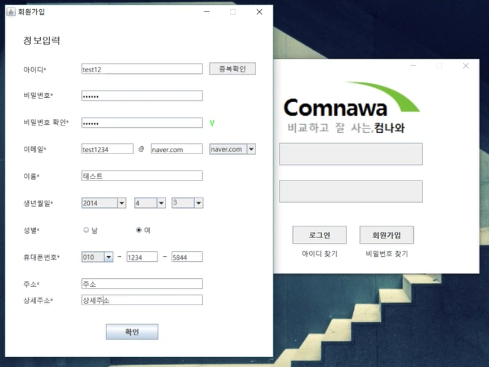

# Comnawa 조립컴퓨터 주문 앱

<ul># Comnawa 프로젝트</ul>
 <li>진행기간 : 17.03.16 ~ 17.03.29</li>
 <li>진행인원 : 4명</li>
 <li>개발환경 : Windows10, Mac OS Sierra</li>
  

### 팀원정보

*<li>조인상 [GitHub][ghinsang] , [StackOverFlow][sfinsang]</li>*
*<li>예상진 [GitHub][ghsangjin]</li>*
*<li>이성원 [GitHub][ghsungwon]</li>*
*<li>이관우 ..</li>*

### <li>핵심화면</li>

{:width="120px"}

[ghsangjin]: https://github.com/sangjin0309
[ghsungwon]: https://github.com/tjddnjs625
[ghinsang]: https://github.com/insangwabcho
[sfinsang]: https://stackoverflow.com/users/8349800/%EC%A1%B0%EC%9D%B8%EC%83%81
