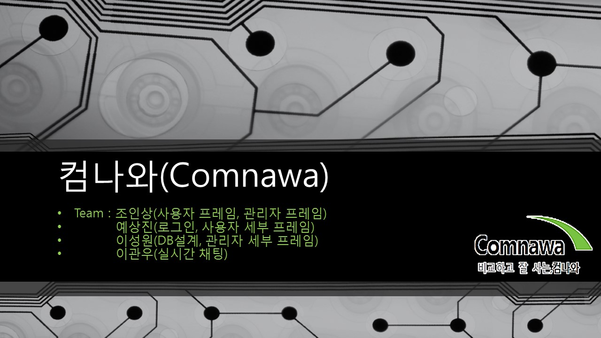

# Comnawa 조립컴퓨터 주문 앱

<ul># Comnawa 프로젝트</ul>
 <li>진행기간 : 17.03.16 ~ 17.03.29</li>
 <li>진행인원 : 4명</li>
 <li>개발환경 : Windows10, Mac OS Sierra</li>
  

### 조인상 [GitHub][ghinsang]
<li>예상진 [GitHub][gh.insang]</li>
<li>이성원 [GitHub][gh.insang]</li>
<li>이관우 ..</li>
There is a mirror of the repository at https://github.com/golang/go.

Unless otherwise noted, the Go source files are distributed under the
BSD-style license found in the LICENSE file.

### Download and Install

#### Binary Distributions

Official binary distributions are available at https://golang.org/dl/.

After downloading a binary release, visit https://golang.org/doc/install
or load doc/install.html in your web browser for installation
instructions.

#### Install From Source

If a binary distribution is not available for your combination of
operating system and architecture, visit
https://golang.org/doc/install/source or load doc/install-source.html
in your web browser for source installation instructions.

### Contributing

Go is the work of hundreds of contributors. We appreciate your help!

To contribute, please read the contribution guidelines:
	https://golang.org/doc/contribute.html

Note that the Go project does not use GitHub pull requests, and that
we use the issue tracker for bug reports and proposals only. See
https://golang.org/wiki/Questions for a list of places to ask
questions about the Go language.

[gh.sangjin]: https://github.com/sangjin0309
[gh.sungwon]: https://github.com/tjddnjs625
[ghinsang]: https://github.com/insangwabcho
[stackoverflow.insang]: https://stackoverflow.com/users/8349800/%EC%A1%B0%EC%9D%B8%EC%83%81
